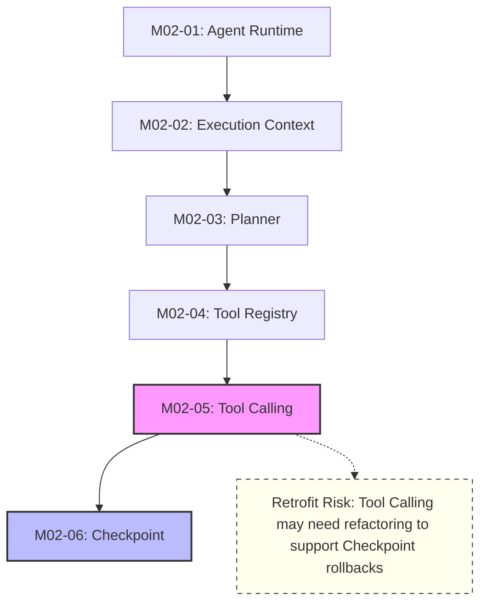
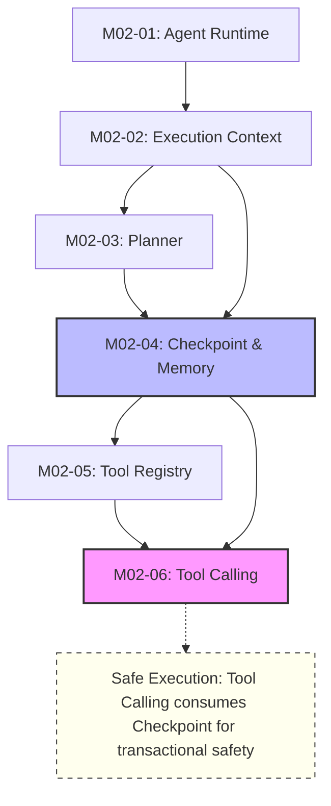

# M02 Architecture Review: Execution Order & Roadmap Analysis

## 1. Why did the roadmap change?
During the implementation of M02-02 (Execution Context), the `ExecutionSnapshot` interface was defined as the immutable representation of the agent's state at a point in time. Because `ExecutionSnapshot` is the foundational data structure required by the Checkpoint system, it was proposed to immediately implement the Checkpoint and Memory interfaces that consume this snapshot. This was a localized, opportunistic decision based on data flow continuity, rather than a formally approved roadmap revision.

## 2. Architectural benefit of implementing Checkpoint before Tool Registry
Implementing Checkpoint before Tool Registry and Tool Calling establishes strict contracts for state persistence, immutability, and rollback *before* we introduce operations that can mutate state (Tools). 

When the Tool Execution layer is subsequently built, it can immediately integrate the Checkpoint contracts to guarantee transactional execution (e.g., automatically taking a snapshot before a high-risk tool runs, and rolling back if the tool fails). If Tool Calling is built first, we risk having to retrofit its architecture later to support state capture and rollback.

## 3. Does this violate the original dependency graph?
Yes, it modifies the chronological implementation sequence. In the original graph, Tool Calling was to be implemented before Checkpoints. However, from a strict dependency perspective, both `ToolRegistry` and `Checkpoint` are independent peer modules that rely on `ExecutionContext`. `ToolCalling` (the execution of tools) logically depends on *both* to operate safely. 

## 4. Dependency Graphs (Mermaid)

### Approach A: Original Roadmap

### Approach B: Proposed Roadmap

## 5. Comparison of Approaches

| Criteria | Approach A (Original) | Approach B (Proposed) | Evaluation |
| :--- | :--- | :--- | :--- |
| **Maintainability** | Moderate | High | Approach B establishes state management before state mutation, leading to cleaner boundaries. |
| **Extensibility** | Moderate | High | Tools built on a pre-existing checkpoint system can easily declare rollback hooks. |
| **Coupling** | Low | Low | Both keep peer modules decoupled. |
| **Cohesion** | Moderate | High | B groups `ExecutionSnapshot` closely with its consumer, `CheckpointStore`. |
| **Future MCP Integration** | Neutral | Positive | MCP (Model Context Protocol) tools often require strict transaction boundaries. Checkpoints first ensure these are ready. |
| **Multi-agent Support** | Neutral | Positive | Multi-agent state handover relies heavily on Checkpoints and Memory. |
| **Testing** | Moderate | Easy | Tool execution tests can immediately mock Checkpoint to test failure recovery. |
| **Rollback Capability** | Retrofitted | Native | B ensures Tool Execution is built with rollbacks in mind from day 1. |
| **Risk of Refactoring** | High | Low | Building Tool Calling before Checkpoints almost guarantees we will have to rewrite the executor to support state saving. |

## 6. Technical Justification & Recommendation
**Recommendation: Adopt Approach B (Checkpoint before Tool Calling).**

**Justification:**
State mutation (Tools) is the most volatile and error-prone aspect of an agentic system. When a tool fails, or when a user rejects a manual approval, the system must revert to a safe state. 

If we implement Tool Calling first (Approach A), we will design the executor around a "happy path" assumption, because the rollback mechanism does not yet exist. When Checkpoints are introduced later, we will be forced to pry open the Tool Executor to insert pre-execution snapshotting and post-failure restoration hooks.

By implementing Checkpoint and Memory first (Approach B), we establish the exact contracts for saving and restoring the `ExecutionContext`. When we build the Tool Executor, it can natively consume these interfaces to provide ACID-like transactional guarantees (execute tool -> if fail -> rollback to snapshot) without future refactoring.

## 7. Recommended Final Roadmap
M02-00 Architecture Skeleton
M02-01 Agent Runtime
M02-02 Execution Context
M02-03 Planner
**M02-04 Checkpoint & Memory Interfaces**
**M02-05 Tool Registry**
**M02-06 Tool Calling**
M02-07 QA

**Confidence Level:** 95%
