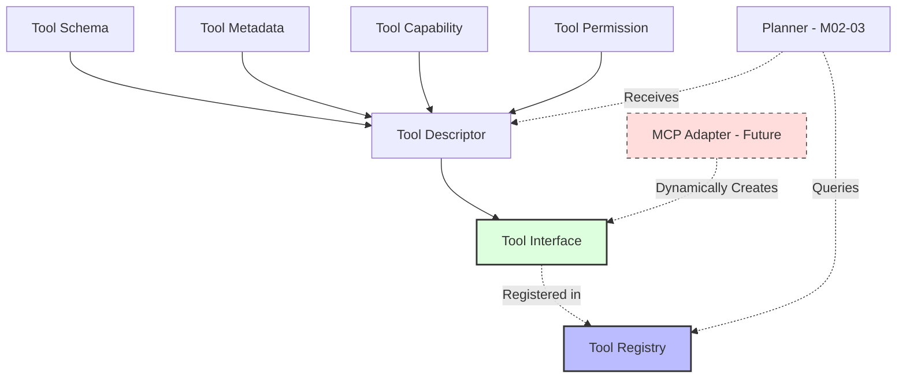

# M02-05: Tool Registry Architecture Proposal

## 1. Vision & Core Philosophy
The Tool Registry is designed as a strict **Plugin Architecture**. It acts as an abstraction layer between the Agent Engine (Runtime/Planner) and the concrete capabilities (Tools). The Registry does not execute tools; it validates, indexes, manages lifecycles, and resolves tools for discovery. 

By treating all tools as generic plugins, the system seamlessly supports native TypeScript functions, future MCP (Model Context Protocol) servers, and remote API extensions without modifying the core runtime.

## 2. Object Model

### Tool Schema
Defines the I/O contract using standard JSON Schema.
- `inputSchema`: Defines required and optional parameters.
- `outputSchema`: Defines the structure of the tool's result.

### Tool Capability
A standardized taxonomy of what a tool can do.
- e.g., `READ_FILE`, `WRITE_FILE`, `NETWORK_REQUEST`, `STATE_MUTATION`, `BROWSER_CONTROL`.
- Used by the Planner to find appropriate tools and by the Runtime to enforce security boundaries.

### Tool Metadata
Descriptive identity.
- `name` (unique identifier)
- `version` (SemVer)
- `description` (Used by the LLM to understand when to use the tool)
- `author`, `tags`

### Tool Permission
Security rules mapped to capabilities.
- Defines if a tool requires explicit user approval (`MANUAL_APPROVAL`).
- Can restrict execution based on the environment (e.g., `production` vs `sandbox`).

### Tool Descriptor
A lightweight data transfer object (DTO) returned during discovery. 
- Contains Metadata, Schema, and Permissions.
- Injected into the LLM context or Planner.
- *Crucially, it does not contain the executable code*, keeping contexts lightweight.

### Tool Interface
The abstract contract every tool must fulfill.
- `getDescriptor()`
- `initialize()`
- `execute(context, input)` (Implementation deferred to M02-06)
- `cleanup()`

## 3. Flows

### Registration Flow
1. **Submission**: A native tool or MCP wrapper is submitted via `ToolRegistry.register(tool)`.
2. **Validation**: Registry validates the JSON schema, checks for name collisions, and verifies SemVer.
3. **Indexing**: Tool is stored and indexed by name, capabilities, and version.
4. **Lifecycle Update**: Tool transitions to `REGISTERED`.

### Discovery Flow
1. **Query**: Planner/Runtime queries `ToolRegistry.findTools(query)`.
   - Queries can filter by name, capabilities, or environment tags.
2. **Feature Flags**: Registry filters out tools hidden behind disabled feature flags.
3. **Resolution**: Registry returns an array of `ToolDescriptor`s.
4. **Injection**: The LLM uses these descriptors to plan or select tool calls.

## 4. Lifecycle & Versioning

### Lifecycle States
- `REGISTERED`: Stored in registry, awaiting initialization.
- `INITIALIZED`: Setup complete (e.g., remote MCP connection established).
- `READY`: Available for active execution.
- `DEPRECATED`: Still functional but emits warnings. Slated for removal.
- `UNREGISTERED`: Removed from the registry.

### Version Strategy
- Strict adherence to Semantic Versioning (SemVer).
- The registry supports multiple versions of the same tool concurrently (e.g., `file_reader@1.0.0` and `file_reader@2.0.0`).
- By default, `getTool("file_reader")` resolves the highest non-deprecated version.

## 5. Future MCP & Remote Tools Integration
The Registry treats MCP as just another tool implementation. 
- When an MCP server is attached, an `MCPAdapter` dynamically queries the server for its tools.
- For each remote tool, the Adapter generates a class implementing the `Tool Interface`.
- These dynamic tools are registered exactly like Native tools.
- To the Planner and Runtime, there is no difference between a local `fs.readFile` tool and a remote MCP `postgres.query` tool.

## 6. Dependency Graph

## 7. Risks & Mitigation
- **Schema Validation Overhead**: Validating complex JSON schemas at runtime could be slow.
  - *Mitigation*: Schema validation occurs strictly during `registration`, not during `discovery` or execution.
- **Namespace Collisions**: Remote MCP tools might share names with Native tools (e.g., `execute_sql`).
  - *Mitigation*: The registry enforces fully qualified names (`namespace/tool_name`, e.g., `core/read_file` vs `mcp_db/read_file`).
- **Memory Leaks**: Remote tools might hold open connections.
  - *Mitigation*: The strict Lifecycle model ensures `cleanup()` is called upon unregistration.
