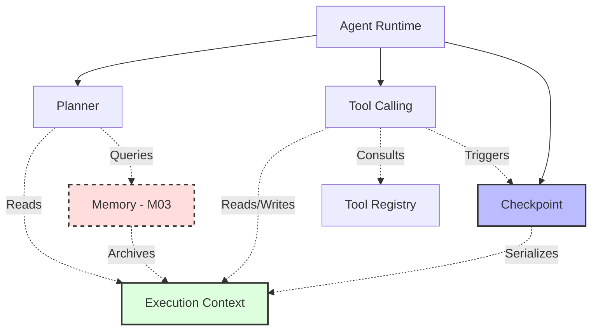

# M02 Architecture Review: Checkpoint and Memory Separation

## 1. Why were Checkpoint and Memory grouped?
Checkpoint and Memory were grouped together under a generalized umbrella of "State Persistence". Checkpoints persist the immediate, short-term deterministic state of an active execution, while Memory typically persists long-term, semantic information across multiple sessions. Grouping them was a conceptual overreach that blurred the line between core runtime mechanics (Checkpoints) and advanced cognitive capabilities (Memory).

## 2. Is Memory part of the runtime architecture, or a future capability?
Memory is a **future capability**. The core runtime architecture only requires the ability to step through a plan, execute tools, and rollback on failure. Memory (e.g., long-term semantic recall, RAG, cross-session vector stores) is a higher-level cognitive feature that feeds context into the Planner or LLM, but it is not strictly required to execute a deterministic task graph.

## 3. Can Checkpoint be implemented completely without introducing Memory?
**Yes, absolutely.** Checkpoints are purely structural. They capture an `ExecutionSnapshot` (variables, artifacts, current step, state) at a specific point in time and store it using a simple key-value or in-memory interface. They do not require any semantic understanding, embedding generation, or long-term recall mechanisms that a Memory system would introduce.

## 4. Revised Roadmap
By extracting Memory into a future milestone, we keep M02 strictly focused on the core Execution Engine.

M02-00 Architecture Skeleton
M02-01 Agent Runtime
M02-02 Execution Context
M02-03 Planner
**M02-04 Checkpoint** (Strictly execution snapshots)
M02-05 Tool Registry
M02-06 Tool Calling
M02-07 QA

*(Memory is moved to M03: Cognitive Capabilities)*

## 5. Dependency Architecture

### Dependency Explanations
*   **ExecutionContext**: The foundational data model. Contains no execution logic.
*   **Planner**: Depends on `ExecutionContext` to understand the current state in order to generate a plan.
*   **Checkpoint**: Depends strictly on `ExecutionSnapshot` (part of Context) to serialize and deserialize state.
*   **Tool Registry**: Independent module holding tool schemas and metadata.
*   **Tool Calling**: Depends on `Tool Registry` for schemas, `ExecutionContext` to read/write variables, and `Checkpoint` to ensure transactional safety (rollback on failure).
*   **Agent Runtime**: The orchestrator. Depends on all of the above to run the lifecycle.
*   **Memory**: Sits parallel to the execution loop. Tools or the Planner might query Memory, and the Runtime might archive an `ExecutionSnapshot` into Memory upon completion, but the core execution loop does not depend on it.

### Mermaid Dependency Graph

## 6. Final Recommendation
**Memory MUST be postponed to M03.** 
Including Memory in M02 violates the principle of separation of concerns. M02 should remain strictly focused on the mechanical orchestration of tasks (the Engine). Memory is a cognitive feature (the Brain) and introduces complexities like vector stores, embeddings, and semantic chunking that distract from stabilizing the core execution runtime. Implementing Checkpoint in isolation provides immediate transactional safety for Tool Calling with zero bloat.
