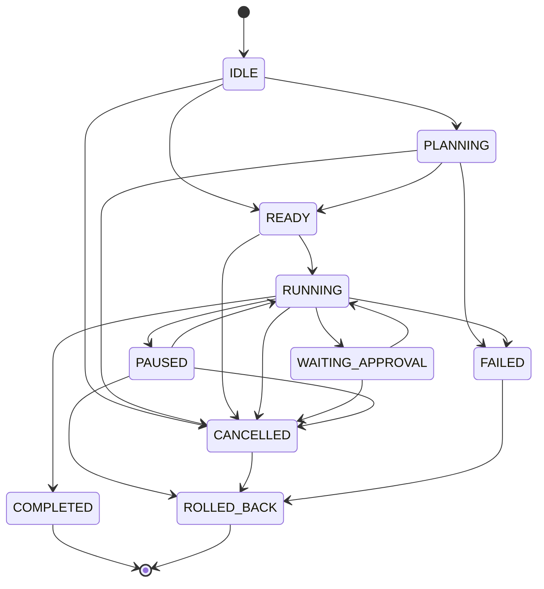

# M02-01: Agent Runtime Report

## Architecture
The Agent Runtime is designed as a standalone orchestrator managing the execution lifecycle of tasks. It encapsulates execution state and acts as a robust state machine independent of any actual tool execution, LLM calls, or memory management. The runtime leverages strongly typed events to allow external systems to subscribe and react to state transitions.

Key design principles employed:
- **High Cohesion & Single Responsibility**: The runtime *only* manages execution lifecycle and state.
- **Dependency Inversion**: It exposes standard interfaces (`ExecutionLifecycle`, `RuntimeEvent`) and does not couple to specific tools or services.
- **Explicit State Transitions**: Transitions are validated against a strict state machine model (`VALID_TRANSITIONS`).

## Files Created/Modified
- `src/agent/runtime/AgentRuntime.ts` (Modified)
- `src/agent/runtime/ExecutionContext.ts` (Modified)
- `src/agent/runtime/ExecutionState.ts` (Modified)
- `src/agent/runtime/ExecutionResult.ts` (Modified)
- `src/agent/runtime/RuntimeEvents.ts` (Modified)
- `src/agent/runtime/ExecutionLifecycle.ts` (Created)
- `src/agent/index.ts` (Modified to export ExecutionLifecycle)

## State Machine Diagram

## Public API
### Types
- `ExecutionState` (enum)
- `ExecutionContext` (interface)
- `ExecutionResult` (interface)
- `RuntimeEvent` (discriminated union of execution events)
- `ExecutionLifecycle` (interface with methods: `createExecution`, `startExecution`, `pauseExecution`, `resumeExecution`, `cancelExecution`, `completeExecution`, `rollbackExecution`)

### Classes
- `AgentRuntime` (implements `ExecutionLifecycle`)
  - Exposes `subscribe(handler: EventHandler): () => void` for event registration.
  - Exposes standard lifecycle methods.

## Future Dependencies
- **Planner Integration**: Will initiate execution transitions from `PLANNING` to `READY`.
- **Tool Executor**: Will listen to `EXECUTION_STARTED` or `RUNNING` to process tools and report back, potentially transitioning to `WAITING_APPROVAL`.
- **Checkpoint Manager**: Will hook into events to save snapshots and trigger `ROLLED_BACK` recovery.

## Regression Risk
- **Low**: The module has zero inbound dependencies currently. It purely establishes the framework structure. All tests and integrations from M02-00 remain intact and unaffected.

## Validation Results
- **Typecheck**: Passed
- **Lint**: Passed
- **Build**: Passed

## Next Recommended Task
**M02-02: Planner implementation**, defining the abstract planning components (`Planner`, `TaskGraph`) that feed into the runtime.
