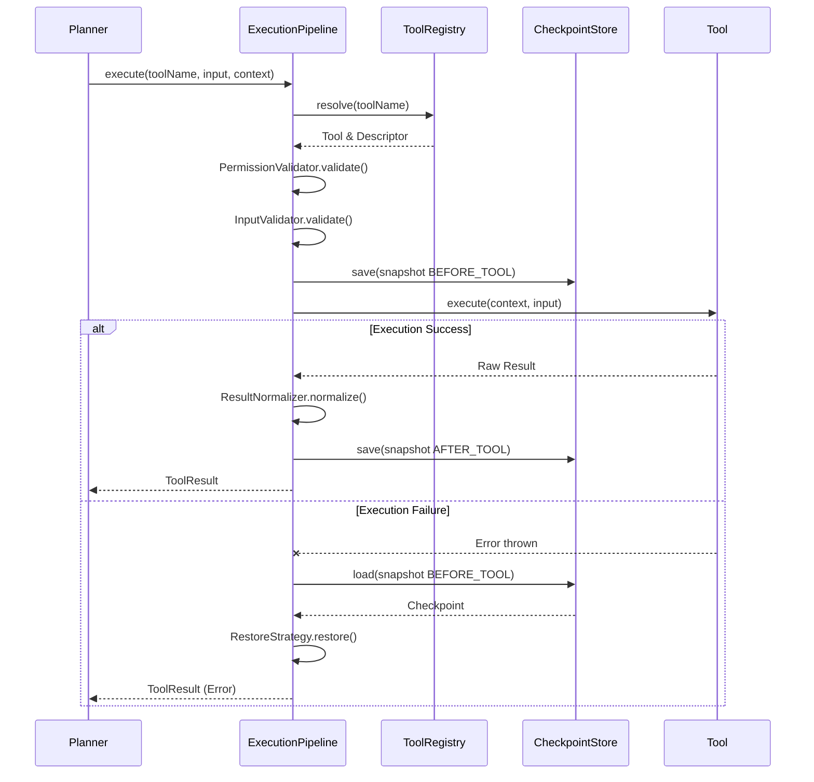

# M02-06: Tool Execution Pipeline Report

## Architecture Summary
The Tool Execution Pipeline provides a robust, robust execution engine connecting the Tool Registry with the Checkpoint system. It strictly abides by the SOLID principles, enforcing strong boundaries between tool resolution, permission verification, input validation, execution, and rollback capabilities.

Crucially, **the entire pipeline is provider-agnostic.** It handles any compliant `Tool` implementation uniformly and contains zero dependencies on specific LLM SDKs (e.g. Gemini, OpenAI).

## Execution Pipeline Diagram

## Dependency Analysis
- **High Cohesion**: Each phase of execution (Resolution, Permission, Validation, Normalization) is handled by a dedicated class.
- **Low Coupling**: `ExecutionPipeline` depends strictly on abstractions (`ToolExecutor`, `ToolRegistry`, `CheckpointStore`).
- **Provider Agnostic**: Confirmed completely agnostic; there are no references to any external SDKs.

## Files Created
- `src/agent/tools/ExecutionError.ts`
- `src/agent/tools/ToolResult.ts`
- `src/agent/tools/ToolResolver.ts`
- `src/agent/tools/PermissionValidator.ts`
- `src/agent/tools/InputValidator.ts`
- `src/agent/tools/ResultNormalizer.ts`
- `src/agent/tools/ExecutionHooks.ts`
- `src/agent/tools/ExecutionPolicy.ts`
- `src/agent/tools/ToolExecutor.ts`
- `src/agent/tools/ExecutionPipeline.ts`

## Files Modified
- `src/agent/tools/index.ts`
- `src/agent/index.ts`

## Public APIs
- `ToolExecutor.execute(toolName, input, context, policy?, hooks?)`: The primary entry point for executing tools.
- `ExecutionHooks`: Provides pre-resolution, pre-execution, post-execution, and error lifecycle hooks.
- `ExecutionPolicy`: Defines `timeoutMs` and `abortSignal` capabilities to gracefully cancel tool executions.

## Regression Risks
- None directly in the pipeline, but the pipeline heavily relies on `ExecutionContext` structured cloning to ensure rollback integrity (fixed in M02-04.1).

## Validation Results
- **Typecheck**: `tsc --noEmit` passed.
- **Lint**: `npm run lint` passed.
- **Build**: `npm run build` passed.

## Architecture Gate Self-Review
**Can this pipeline support Native tools, Plugin tools, MCP tools, Remote tools?**
*Yes.* The pipeline only interacts with the generic `Tool` interface. As long as a remote MCP server is wrapped in a class that implements `Tool`, the pipeline will execute it without any modifications.

**Can this pipeline support Future parallel execution, streaming execution, multi-agent?**
*Yes.* The `ExecutionPipeline` is entirely stateless. It receives an `ExecutionContext` on every call. For parallel execution, higher-level orchestrators simply invoke the pipeline concurrently across independent contexts. `ExecutionPolicy` provides native abort capabilities required for multi-agent cancellation flows. For streaming, we would need to extend `ToolResult` or create a `StreamingToolExecutor` interface that returns an AsyncIterator, but the current structural foundation requires no teardown.

**Conclusion: APPROVED**
