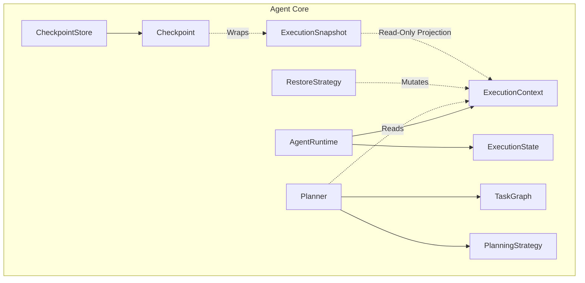

# M02 Architecture Gate: Pre-Tool Registry Review

## Architecture Score
**90 / 100** (Excellent structural foundations, highly decoupled, strict interface boundaries)

## Dependency Diagram

## Module Relationships
- **Runtime**: Operates strictly as a robust state machine and event emitter. It manages multiple parallel contexts natively via `executionId`, ensuring multi-agent readiness.
- **ExecutionContext**: Acts as the single source of truth data model. It uses an immutable `ExecutionSnapshot` projection to interface with the Checkpoint layer.
- **Planner**: Utilizes the Strategy pattern (`PlanningStrategy`), which completely decouples the task graph (DAG) execution logic from any LLM provider, guaranteeing provider-agnostic behavior.
- **Checkpoint**: Abstracts storage, serialization, and restoration. It relies on the `ExecutionSnapshot` interface, keeping it ignorant of the Runtime's internal state machine.

## Risk Assessment & Technical Debt

### 1. Shallow Copy Mutation Risk (Medium Severity)
**Description:** In `ExecutionContext.createSnapshot()` and `DefaultRestoreStrategy.restore()`, the code uses JavaScript spread syntax (e.g., `{ ...this.temporaryVariables }`). This creates a shallow copy.
**Impact:** When we implement Tool Calling in M02-06, if a tool mutates a nested property of an object variable, it will mutate the reference held inside the snapshot as well. This completely breaks the rollback guarantee.
**Mitigation:** `createSnapshot` and `RestoreStrategy` must use deep cloning (e.g., `structuredClone` or serialization) for all nested data structures (`variables`, `artifacts`, `outputs`).

### 2. The Missing Execution Engine (Low Severity - Pending M02-06)
**Description:** Currently, `AgentRuntime` transitions state and manages the lifecycle (start, pause, complete), but there is no "tick" or "loop" that actually iterates over the `TaskGraph`, evaluates dependencies, and triggers tools.
**Impact:** The core loop needs to be built.
**Mitigation:** This is expected. The execution loop should be built in M02-06 (Tool Calling) or as a separate `ExecutionEngine` module that consumes `AgentRuntime`, `Planner`, and `ToolRegistry`.

## Future Compatibility Check
- **Future Tool Registry**: `Planner` already relies on a lightweight `ToolMetadata` object (name, version, description) which perfectly maps to the Tool Registry architecture proposal.
- **Future Tool Calling**: Tool execution will natively consume `ExecutionSnapshot` via Checkpoint for transactional boundaries.
- **Future MCP Compatibility**: `ToolMetadata` and standard schemas will seamlessly wrap remote MCP servers.
- **Future Multi-Agent**: The `workspaceId` and `executionId` in the Context natively support isolating multiple agents across shared workspaces.
- **Future Memory Compatibility**: Context provides a generic `metadata` and `customTags` dictionary, making it easy to embed vector IDs or memory pointers later.

## Recommended Improvements
1. **Implement Deep Cloning**: Refactor `ExecutionContext` and `RestoreStrategy` to use deep cloning before M02-06.
2. **Keep Engine Separate**: When building Tool Calling, consider creating an `ExecutionEngine` class that drives the loop, leaving `AgentRuntime` as a strict state/lifecycle manager to maintain SOLID principles (Single Responsibility).

## Decision
**APPROVED** 

The architecture is clean, provider-agnostic, and well-separated. The Tool Registry (M02-05) can be implemented securely without coupling to any existing runtime logic. The shallow copy technical debt should be addressed before M02-06.
