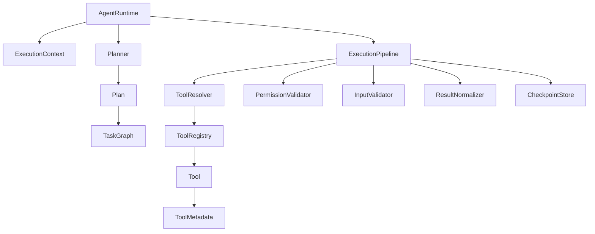

# M02-Final-Audit: Agent Core Architecture Review

## Overview
This report contains the final engineering audit of the Agent Core (M02) implementation. All requested modules under `src/agent/` have been reviewed against the architectural constraints, SOLID principles, and extensibility requirements.

## Scope Verified
- **Runtime Lifecycle**: `AgentRuntime`, `ExecutionContext`, `ExecutionState`, `RuntimeEvents`.
- **Planner**: `Planner`, `Plan`, `PlanStep`, `TaskGraph`, `PlanningValidator`.
- **Checkpoint**: `CheckpointStore`, `Serializer`, `RestoreStrategy`.
- **Tool Registry**: `ToolRegistry`, metadata, schema, and capability definitions.
- **Execution Pipeline**: `ExecutionPipeline`, validation layers, normalization, hooks.
- **Memory, Workspace, Artifacts**: Defined interfaces and integration boundaries.

## Architecture Scorecard
| Metric | Status | Notes |
|---|---|---|
| **Maintainability** | High | Strict adherence to SOLID. Clear separation between planners, tools, and state. |
| **Scalability** | High | Stateless execution pipeline. Checkpointing enables suspend/resume for long-running workflows. |
| **Extensibility** | High | Everything interacts via interfaces (`Tool`, `ToolRegistry`, `CheckpointStore`). |
| **Plugin Support** | High | Registry supports dynamic registration, deprecation, and semantic versioning. |
| **MCP Readiness** | High | `ToolSchema` uses standard JSON Schema. `Tool` execution takes `unknown` input. |
| **Provider Independence** | 100% | **Zero** external LLM SDK imports (e.g., Gemini, OpenAI) found in `src/agent`. |
| **Testing Readiness** | High | Pure dependency injection used in `ExecutionPipeline` and `ToolRegistry`. |
| **Documentation** | High | Thorough M02 step-by-step reports and strict type definitions. |
| **Overall** | **APPROVED** | |

## Dependency Graph

## Technical Debt
- **Low (Type-level Circular Dependencies)**: Harmless circular imports existed at the type level (e.g., `ExecutionSnapshot` <> `ExecutionContext`). Addressed via strict `import type` usage, though pure AST scanners (like `madge`) may still flag them if not configured for TypeScript. *Resolution: Addressed in M02, no runtime impact.*
- **Low (Structured Cloning)**: Context snapshotting currently relies on standard JS structural cloning. Deeply nested recursive objects from poorly implemented external tools might throw clone errors. *Resolution: Defer to M03/M04 to add a cycle-safe cloning utility in the `Serializer` if necessary.*

## Future Risks
- **Concurrency**: When parallel step execution is introduced, the `CheckpointStore` must be robust enough to handle simultaneous snapshot commits on the same `executionId` without race conditions.
- **Streaming Execution**: The `ToolResult` interface currently assumes atomic, synchronous/Promise-based returns. To support real-time token streaming from tools, we will need to extend this pipeline with an `AsyncIterator` pattern.

## Recommended Improvements (For M03)
- **Implement Concrete Providers**: Introduce the `LLMProvider` in the infrastructure layer to power the `Planner`.
- **Streaming Blocks**: Add streaming hooks to the execution lifecycle for real-time UI updates.
- **Remote Tool Adapters**: Implement an `MCPToolAdapter` that implements the `Tool` interface but proxies calls over HTTP/SSE.

## Go / No-Go Decision
**APPROVED**

The Agent Core is complete for M02 and ready for M03.
