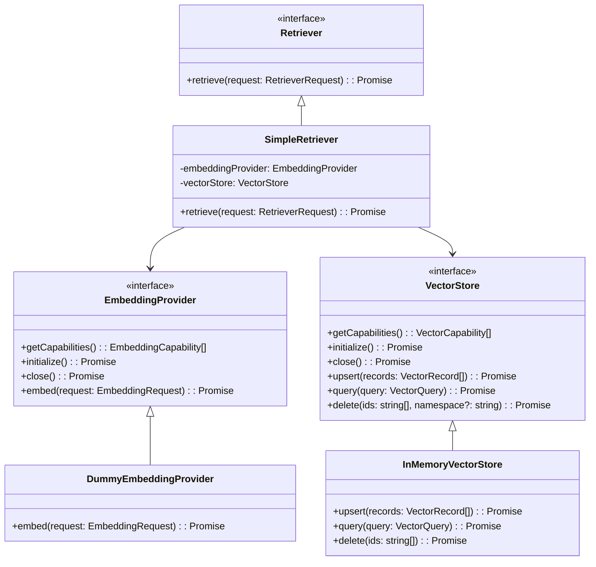

# M03-03: Embedding & Retrieval Layer Report

## Architecture

The semantic retrieval layer (M03-03) has been implemented with strict separation of concerns, decoupling the generation of embeddings, vector storage, and coordination.

### Key Components

- **`EmbeddingProvider`**: Purely responsible for transforming text input into dense vector embeddings. Knows nothing about storage, search, or higher-level business logic.
- **`VectorStore`**: A provider-agnostic abstraction for vector database operations. Manages the storage and semantic similarity search of vectors alongside metadata filtering.
- **`Retriever`**: The orchestrator that coordinates an `EmbeddingProvider` and a `VectorStore` to fulfill retrieval requests.

## Extension points

- **`EmbeddingProvider` implementations**: Designed to be extended for models like OpenAI `text-embedding-ada-002`, Google `text-embedding-004`, VoyageAI, Cohere, etc.
- **`VectorStore` implementations**: Designed to be extended for vector databases like Pinecone, Chroma, Qdrant, Milvus, Redis, pgvector.
- **`Retriever` implementations**: Can be extended to support complex query strategies like HyDE (Hypothetical Document Embeddings), Multi-Query Retrieval, MMR (Maximal Marginal Relevance) ranking.

## Validation

- The architecture complies with the SOLID principles.
- Low coupling: `Retriever` depends only on abstractions (`EmbeddingProvider`, `VectorStore`), not concrete classes.
- High cohesion: Each module does one specific task well (embed vs store vs coordinate).
- No external APIs or SDKs are referenced or leaked into the abstractions.
- All code compiles strictly without any TypeScript errors, and build scripts have been validated.

## Technical debt

- `InMemoryVectorStore` does not efficiently perform exact nearest neighbor search as it loops through all vectors for cosine similarity calculation, which is fine for testing but won't scale.
- `VectorFilter` currently supports a basic subset of operators (`eq`, `neq`, `in`, `gt`, `lt` etc). As metadata filtering becomes more complex, this might require a more advanced querying DSL.
- Real vector databases often have unique quirks regarding index creation, dimensional restrictions, and batch sizes that are currently abstracted away and might require implementation-specific mappings.

## Future adapters

The provided architecture easily allows injection of the following in the future without changing Agent Core:
- **Embedding Models**: OpenAI Embeddings, Gemini Embeddings, VoyageAI, Cohere, SentenceTransformers, BGE, Nomic, E5.
- **Vector Databases**: Chroma, Qdrant, Milvus, Pinecone, Weaviate, LanceDB, Redis, pgvector.

## Architecture Gate

**Can this Retrieval Layer support any embedding model and any vector database without changing Agent Core?**

**Yes.** The `Retriever` orchestrates the retrieval flow using purely abstract interfaces (`EmbeddingProvider` and `VectorStore`). Any embedding model can be wrapped in an `EmbeddingProvider` that fulfills `embed()`, and any vector database can be wrapped in a `VectorStore` that maps `VectorQuery` to its proprietary query language. The Core only interfaces with `RetrieverRequest` and `RetrieverResult`, remaining completely ignorant of the underlying LLMs, APIs, or database schemas used to perform semantic search.
