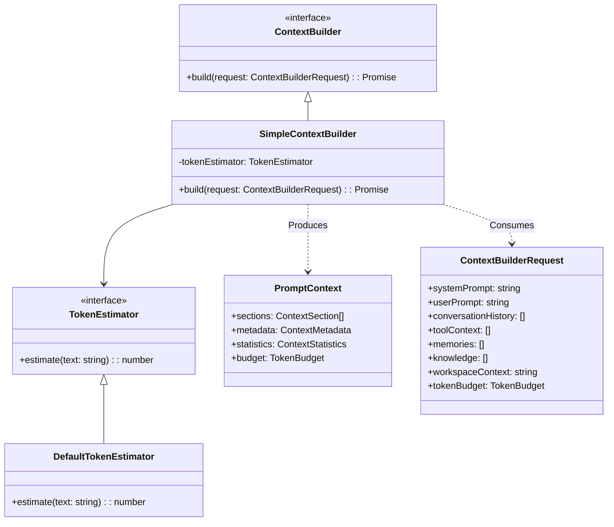

# M03-04: Context Builder Report

## Architecture

The Context Builder (M03-04) handles the responsibility of assembling prompt context for Language Models, cleanly decoupled from runtime execution and LLM SDKs.

### Prompt Assembly Flow

1. **Ingestion**: `ContextBuilderRequest` aggregates decoupled data from MemoryProvider, KnowledgeStore, Retriever, and Workspace.
2. **Structuring**: Raw strings and objects are wrapped into `ContextSection` objects with predefined metadata (e.g. `type: 'MEMORY'`, `priority`).
3. **Deduplication**: Identical sections (by ID) are filtered to prevent redundant tokens.
4. **Ranking & Prioritization**: Sections are ordered by `priority` descending, ensuring that the System Prompt and User Prompt are safely kept at the highest priority while less critical memories or history elements act as filler.
5. **Token Budgeting**: A `TokenEstimator` sequentially tallies section lengths. If a section exceeds the `maxTokens - reservedCompletionTokens`, it is aggressively truncated or skipped.
6. **Emission**: A structured `PromptContext` is produced.

## Extension points

- **`TokenEstimator`**: Can be swapped for tokenizer-specific implementations (e.g., `tiktoken` for OpenAI, or `gemini-tokenizer` for Gemini) to ensure perfect token alignment instead of the naive string-length heuristic.
- **`ContextBuilder`**: Advanced implementations could perform recursive summarization when context overflows rather than simple truncation.

## Validation

- **No Provider Dependency**: Returns agnostic `PromptContext` objects. Does not import `@google/genai` or `openai`.
- **No Mutations**: Operates entirely functionally on `ContextBuilderRequest`. Performs zero mutations on `MemoryProvider` or the `Runtime`.

## Future Compatibility

This architecture trivially supports:
- Passing `PromptContext` directly to Reflection or Learning agents as structured data.
- Applying JSON-serialization for `MCP` compliance, since all states and sections are POJOs.

## Architecture Gate

**Can this Context Builder later support OpenAI, Gemini, Claude, DeepSeek, Qwen, Llama without modification?**
**Yes.** The `ContextBuilder` outputs a neutral `PromptContext` containing a list of `ContextSection` blocks. The Agent Core or specific LLM Provider adapters will be responsible for stringifying this list into the native message shape (e.g., `[{role: 'system', content: ...}]` for OpenAI, or native parts for Gemini).

**Can PromptContext be reused by Reflection, Learning, and MCP?**
**Yes.** `PromptContext` inherently retains metadata about every section (`type: KNOWLEDGE`, `id`, `tokenCount`). Reflection layers can inspect `PromptContext.statistics` to identify truncated knowledge that might trigger an explicit summary command, or `MCP` can serve this structured payload directly to clients for debugging.
