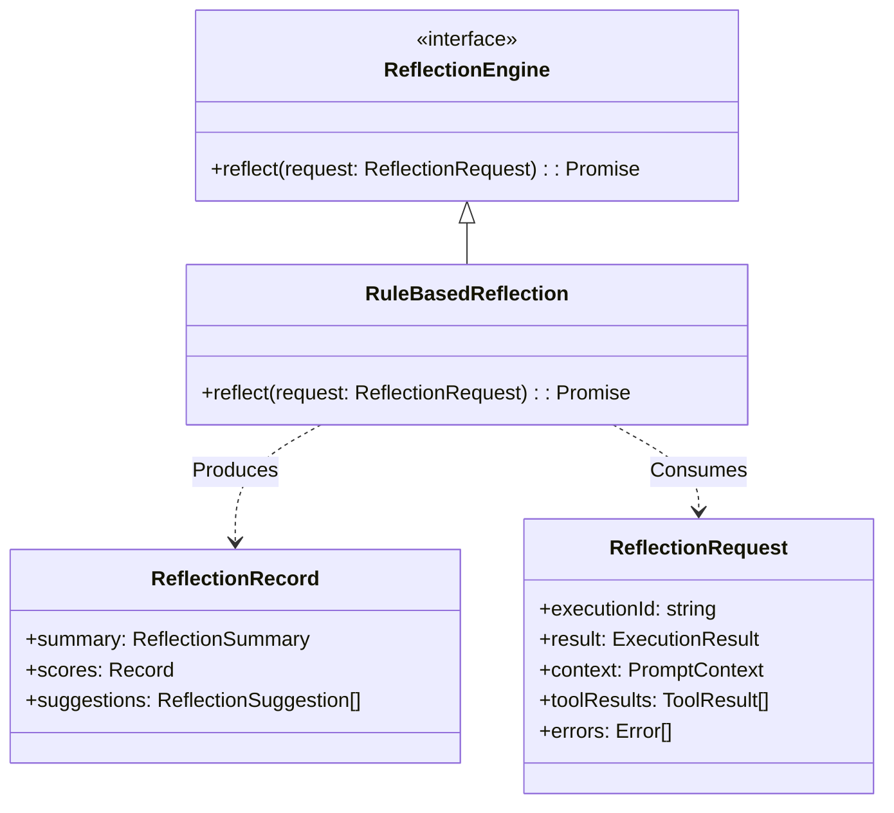

# M03-05: Reflection Engine Report

## Architecture

The Reflection Engine (M03-05) performs post-execution self-evaluation. It consumes the artifacts of an execution (result, tools, context, errors) and outputs structured reflection records that score the agent's performance, without triggering new actions or mutating the runtime environment.

### Reflection Flow

1. **Ingestion**: The runtime passes the final `ExecutionResult`, along with any intermediate artifacts like `PromptContext` and `ToolResults`, to the `ReflectionEngine` after the cycle completes.
2. **Evaluation**:
   - Evaluates **Execution Success**: Deducts points and records failure reasons if the outcome was unsuccessful or errored.
   - Evaluates **Tool Quality**: Inspects `ToolResults` for failures, noting which tools caused issues.
   - Evaluates **Context Quality**: Inspects `PromptContext` for truncation or budgeting issues.
3. **Scoring & Suggestions**: Generates categorical scores (0-100) and actionable suggestions (e.g., "Investigate the root cause of the execution failure").
4. **Emission**: Returns a purely immutable `ReflectionRecord`.

## Extension Points

- **`ReflectionEngine`**: While currently implemented as a deterministic `RuleBasedReflection` engine, the interface asynchronously returns a `ReflectionRecord`, allowing for LLM-based evaluators in the future.

## Future LLM Reflection Support

Because `ReflectionEngine` defines a simple asynchronous contract (`reflect()`) taking POJO inputs and returning structured data, it can trivially be swapped for an implementation that:
- Prompts an LLM (e.g., Gemini, Claude) with the `ExecutionResult` and `PromptContext`.
- Requests a JSON schema matching `ReflectionRecord`.
- Parses and returns the LLM's subjective evaluation.

## Architecture Gate

**Can Reflection later be powered by Gemini, Claude, OpenAI, Qwen, DeepSeek without modifying Runtime?**
**Yes.** The `ReflectionEngine` interface is completely agnostic to *how* the reflection is generated. An `LLMReflectionEngine` adapter can be injected into the runtime, making network calls to Gemini or OpenAI under the hood to generate the `ReflectionRecord`, without the `Runtime` knowing the difference.

**Can Reflection feed Learning without coupling?**
**Yes.** The `ReflectionRecord` is a structured, serializable data object containing categorized suggestions and mistakes. The Learning engine can subscribe to these records (e.g., via event emitters or a shared database) to extract long-term memory updates or adjust behavior without needing to directly reference the `ReflectionEngine` class or its dependencies.
