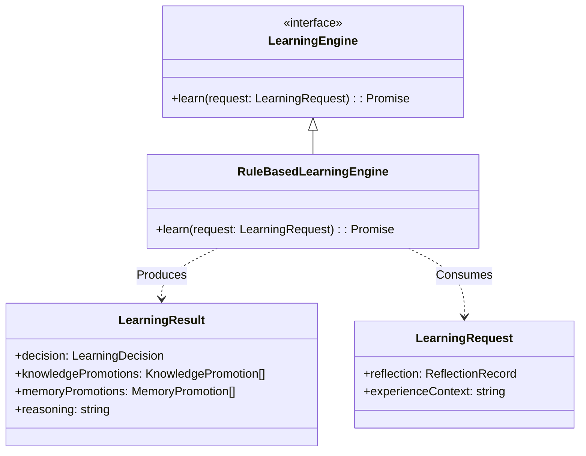

# M03-06: Learning Engine Report

## Architecture

The Learning Engine (M03-06) evaluates post-execution reflections to determine what transient experiences should be promoted into durable knowledge or long-term memory. It operates purely as a decision-maker, emitting promotion instructions without mutating the runtime or storage directly.

### Learning Flow & Promotion Rules

1. **Ingestion**: The `LearningEngine` receives a `LearningRequest` containing the `ReflectionRecord` (from M03-05).
2. **Analysis**:
   - Analyzes `detectedMistakes` to extract specific corrections.
   - Analyzes `potentialImprovements` to extract heuristic enhancements.
3. **Decision Making (Promotion Rules)**:
   - **Experience → Knowledge**: If execution was successful but there are `potentialImprovements`, they are converted into `KnowledgePromotion` objects. These represent generalized skills or heuristics.
   - **Experience → Memory**: If `detectedMistakes` occurred, they are converted into `MemoryPromotion` objects. These represent specific episodic corrections ("Avoid doing X in scenario Y").
   - **Human Approval**: If the reflection score is critically low (< 30), the decision is flagged as `REQUIRES_HUMAN_APPROVAL`, blocking automatic promotion to prevent poisoning the knowledge base.
   - **Discard**: If no meaningful lessons were extracted, the experience is discarded to save token context.
4. **Emission**: Returns a `LearningResult` containing the final decision and the respective promotions, leaving the actual data writing to the overarching orchestrator.

## Extension Points

- **`LearningEngine`**: Designed to be replaced with an LLM-based engine that can synthesize multiple experiences or dynamically compress complex reflections into abstract concepts.

## Architecture Gate

**Can Learning later be powered by Gemini, Claude, OpenAI without changing Agent Core?**
**Yes.** The `LearningEngine` exposes a purely asynchronous interface (`learn()`) taking structured request data and returning a structured decision. An LLM implementation would simply serialize the `ReflectionRecord`, prompt the LLM to extract "Knowledge" and "Memory", parse the structured output, and return a standard `LearningResult`. The Agent Core executes the resulting `Promotions` regardless of whether they were generated by rules or by Gemini.

**Can Learning support human approval before promoting knowledge?**
**Yes.** The `LearningDecision` enum specifically includes a `REQUIRES_HUMAN_APPROVAL` state. The orchestrator can intercept this state, pause the learning loop, and emit a request to a UI or webhook for human authorization, executing the promotions only upon approval.
