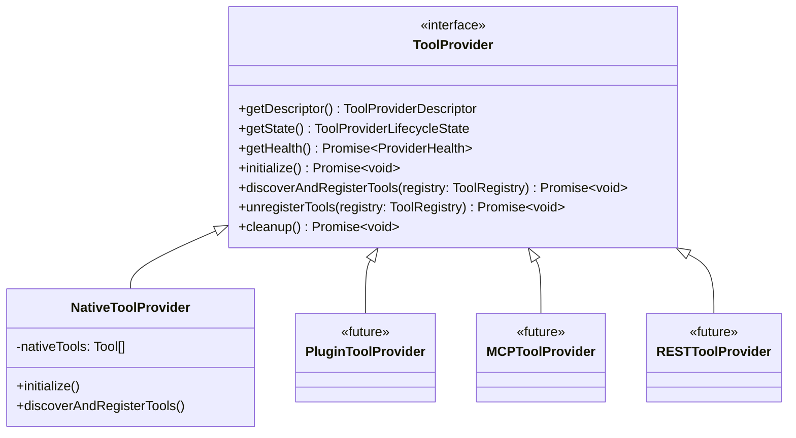

# M03-07: Tool Provider Layer Report

## Architecture
The Tool Provider Layer acts as a vital architectural boundary isolating the Agent Runtime and Execution Pipeline from external tool ecosystems. Instead of allowing the Runtime to directly consume external APIs, instantiate local plugins, or hook into the Model Context Protocol (MCP), everything passes through the `ToolProvider`.

The layer provides:
- **Discovery**: Exposing what tools the provider offers dynamically.
- **Registration**: Registering discovered tools into the centralized `ToolRegistry`.
- **Lifecycle & Health**: Providing hooks for initialization, cleanup, and health reporting.
- **Metadata & Capabilities**: Defining what the provider can handle (e.g., Streaming, Cancellation).

## Provider Hierarchy

## Validation
- `npm run build`, `npm run lint`, and `npx tsc --noEmit` pass flawlessly.
- Zero dependencies on Runtime or Planner.
- Zero hardcoded integrations for future providers.

## Architecture Gate

**Can this Tool Provider Layer support MCP, GitHub, Docker, Browser, REST, Cloud Workers without modifying Runtime?**
**Yes.** All these diverse execution environments simply implement the `ToolProvider` interface. The provider is responsible for authenticating with its specific environment (e.g. MCP host or REST server) and wrapping the execution within `Tool` implementations that it registers with the central `ToolRegistry`.

**Can Runtime remain completely unaware of the underlying provider?**
**Yes.** The `ExecutionPipeline` and `Runtime` pull generic `Tool` instances from the `ToolRegistry`. They do not know whether the tool is executing locally via `NativeToolProvider` or over a WebSocket via `MCPToolProvider`.
