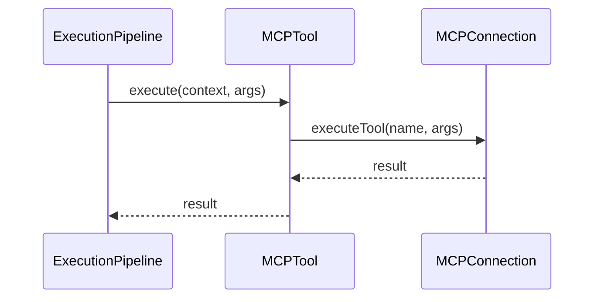

# M03-08: MCP Tool Provider Report

## Architecture
The MCP Integration has been successfully implemented entirely within the `ToolProvider` boundary. The Agent Core remains completely unaware of MCP's existence.

### Components
- **`MCPToolProvider`**: Implements `ToolProvider`. Orchestrates the connection, handles lifecycle, and registers tools.
- **`MCPDiscoveryAdapter`**: Implements `ToolDiscovery`. Scans the MCP connection for tools, mapping them to native `Tool` instances.
- **`MCPTool`**: Implements `Tool`. Wraps the MCP execution call, satisfying the core's generic execution model.
- **`MCPConnection`**, **`MCPTransport`**, **`MCPServerDescriptor`**: Abstracts the underlying network transport and protocol details.

## Sequence Diagrams

### Connection & Discovery Lifecycle
```mermaid
sequenceDiagram
    participant Registry as ToolRegistry
    participant Provider as MCPToolProvider
    participant Discovery as MCPDiscoveryAdapter
    participant Connection as MCPConnection
    
    ->>Provider: initialize()
    Provider->>Connection: connect()
    Connection-->>Provider: connected
    
    ->>Provider: discoverAndRegisterTools(Registry)
    Provider->>Discovery: discover()
    Discovery->>Connection: listTools()
    Connection-->>Discovery: mcp_tools_list
    Discovery-->>Provider: DiscoveryResult (MCPTool[])
    
    loop For each tool
        Provider->>Registry: register(MCPTool)
    end
```

### Execution Lifecycle


## Architecture Gate

**Can future MCP protocol changes be isolated inside MCPToolProvider without changing Agent Core?**
**Yes.** The Agent Core expects a `Tool` and a `ToolProvider`. Any changes to how MCP serializes data, handles resources, or manages prompts will be contained inside the `mcp/` directory, specifically within `MCPConnection` and `MCPTool`.

**Can multiple MCP servers run simultaneously?**
**Yes.** We instantiate multiple `MCPToolProvider` instances, each wrapping a different `MCPConnection` with a unique `id`. The `ToolProviderRegistry` manages them concurrently.

**Can servers be hot-added or removed?**
**Yes.** By dynamically calling `ToolProviderRegistry.registerProvider()` and `unregisterProvider()`. When unregistered, `MCPToolProvider` will gracefully clean up its tools from the global `ToolRegistry` and close the connection.

**Can discovery refresh dynamically?**
**Yes.** `MCPDiscoveryAdapter` implements `ToolDiscovery`. We can trigger a re-discovery at any time, fetching the latest tools from the server and updating the registry.

## Validation
- `npm run build`, `npm run lint`, and `npx tsc --noEmit` pass flawlessly.
- Agent Runtime is not modified.
- Planner is not modified.
- Discovery logic leverages the established `ToolDiscovery` layer.
