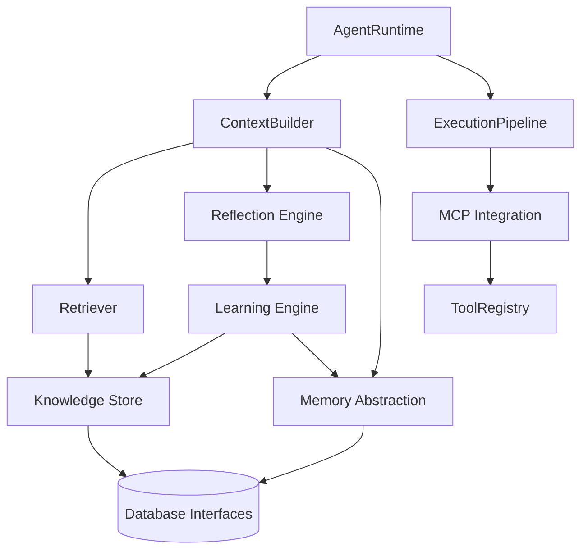

# M03 Architecture Proposal: Cognitive Layer ("The Brain")

## Goals
The primary goal of M03 is to define "What the Agent knows." This involves building a robust, extensible, and provider-agnostic cognitive layer on top of the M02 Execution Engine. The architecture must strictly separate execution, memory, knowledge storage, retrieval, reflection, and learning.

## Architecture Overview
The M03 architecture introduces a Cognitive Layer that wraps around the M02 Execution Engine. The `ContextBuilder` acts as the bridge, assembling information from `MemoryAbstraction` and `KnowledgeStore` (via `Retriever`) into a prompt for the `Planner`. After execution, the `ReflectionEngine` evaluates the result, and the `LearningEngine` translates reflections into persistent knowledge.

### Dependency Graph

## Module Responsibilities
- **Memory Abstraction (`src/agent/memory`)**: Manages short-term (working context), episodic (historical traces), and semantic (extracted facts) memory.
- **Knowledge Store (`src/agent/knowledge`)**: Abstracts vector databases and document stores. Agnostic to underlying tech (SQLite, Pinecone, Chroma).
- **Retriever (`src/agent/retrieval`)**: Manages embedding generation and similarity search logic.
- **Reflection Engine (`src/agent/reflection`)**: Evaluates execution outcomes to generate critiques and actionable advice.
- **Learning Engine (`src/agent/learning`)**: Consolidates episodic memory and reflections into long-term semantic knowledge.
- **Context Builder (`src/agent/context`)**: Safely packs memory, retrieved knowledge, and configuration into a context window respecting token limits.
- **MCP Integration (`src/agent/mcp`)**: Adapts external MCP servers into the M02 `Tool` interface.

## Extension Points
- **Database Adapters**: `VectorStore` and `MemoryStore` interfaces allow easy drop-in of Postgres, Redis, or any future DB.
- **Embedding Providers**: `EmbeddingProvider` interface allows swapping between OpenAI, Gemini, local models, etc.
- **Reflection Logic**: Can range from simple deterministic heuristics to complex LLM-as-a-judge patterns.

## Technical Risks & Mitigation
- **Risk:** Token limit explosion during `ContextBuilder` assembly.
  - **Mitigation:** Implement strict token estimation and prioritization (System > Task > Tools > Memory > Knowledge).
- **Risk:** Vendor lock-in with vector embeddings.
  - **Mitigation:** The `EmbeddingProvider` is completely abstracted. `VectorStore` uses standard `number[]` for vectors.
- **Risk:** Circular dependencies between Execution and Learning.
  - **Mitigation:** Strict unidirectional flow. `LearningEngine` reads `ExecutionResult` but does not invoke `AgentRuntime`.

## Migration & Compatibility with M02
This architecture is 100% backward compatible with M02. The M02 Execution Engine remains the core. M03 simply provides richer `PlanningContext` (via `ContextBuilder`) and handles post-execution processing (via `ReflectionEngine`). MCP tools will implement the existing `Tool` interface, requiring zero changes to the M02 `ExecutionPipeline`.

## Alternatives Considered
- **Direct LLM Integration for Retrieval:** Bypassing the `Retriever` and letting the LLM directly call a "SearchTool". 
  - *Reason for Rejection:* Harder to enforce context window limits and optimize latency. A dedicated retrieval step before planning provides better control.
- **Merging Memory and Knowledge:** Treating all memories as vector documents.
  - *Reason for Rejection:* Episodic memory is often temporal and relational, while knowledge is semantic. Separating them allows for distinct storage strategies (e.g., relational DB for episodes, vector DB for knowledge).

## Conclusion
The proposed architecture provides a scalable, provider-agnostic foundation for the Agent's cognitive capabilities. It strictly adheres to SOLID principles and future-proofs the system against changes in AI providers or database technologies.
